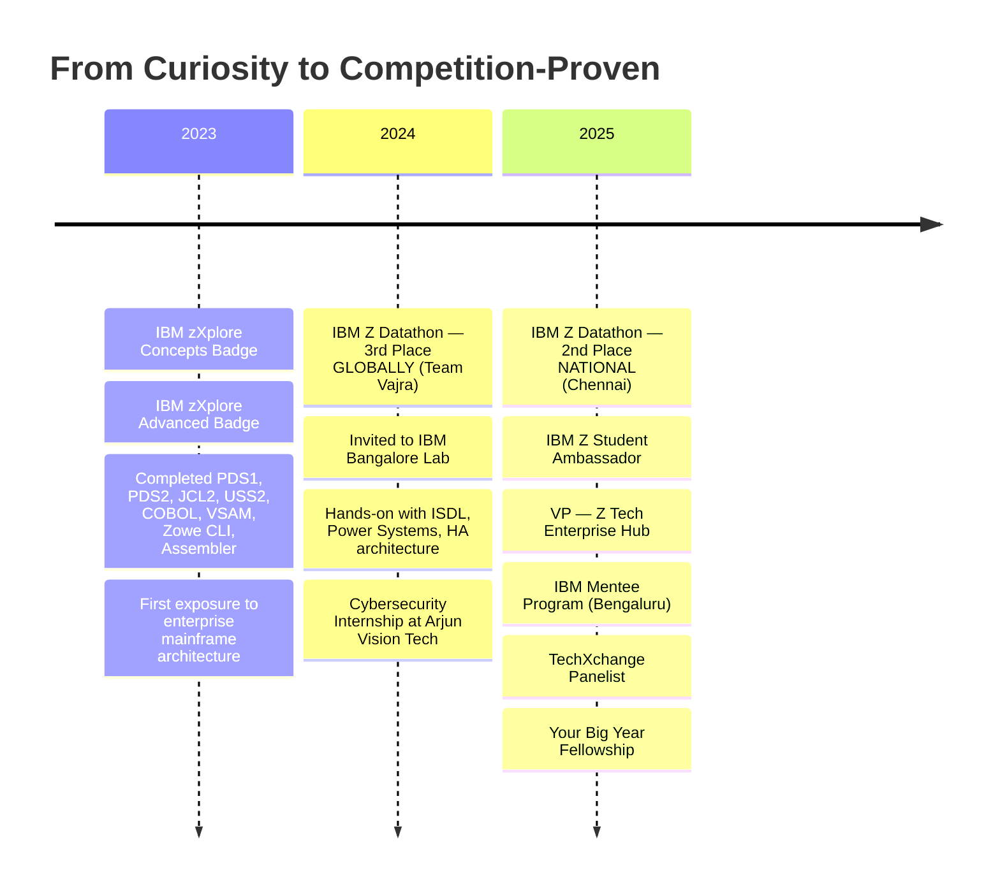

<div align="center">

<!-- ANIMATED HEADER -->


<br/>


<br/>

<!-- TERMINAL WHOAMI -->
```
┏━━━━━━━━━━━━━━━━━━━━━━━━━━━━━━━━━━━━━━━━━━━━━━━━━━━━━━━━━━━━━━━━━━━━━━━━━━━━┓
┃                                                                              ┃
┃   $ whoami                                                                   ┃
┃                                                                              ┃
┃   NAME        Shivraj R                                                      ┃
┃   ROLE        B.E. CSE (IoT) · Saveetha Engineering College · 2023–2027     ┃
┃   LOCATION    Chennai, Tamil Nadu 🇮🇳                                         ┃
┃   FOCUS       IBM Z Mainframes · Cybersecurity · Blockchain · Simulations    ┃
┃   DIRECTION   Mainframe Modernization · Enterprise Security · Secure Infra   ┃
┃   STATUS      IBM Z Ambassador · VP, Z Tech Hub · Your Big Year Fellow       ┃
┃                                                                              ┃
┃   RECORD      🏆 IBM Z Datathon 2024 — 3rd GLOBAL (Team Vajra)              ┃
┃               🏆 IBM Z Datathon 2025 — 2nd NATIONAL                          ┃
┃               🎖️  IBM Bangalore Lab — Invited (ISDL + Power Systems)          ┃
┃                                                                              ┃
┗━━━━━━━━━━━━━━━━━━━━━━━━━━━━━━━━━━━━━━━━━━━━━━━━━━━━━━━━━━━━━━━━━━━━━━━━━━━━┛
```

<br/>

<!-- BADGES -->
[](https://github.com/ShivrajRajasekaran)
[](https://www.linkedin.com/in/shivraj-r-18008b290/)
[](https://portfolio-shivraj.web.app/)
[](mailto:rshivrajrajasekaran@gmail.com)
[](https://github.com/ShivrajRajasekaran)

</div>


## The Story

I didn't start with a plan. I started with curiosity — pulling systems apart to see how they worked, then figuring out how to put them back together stronger.

That curiosity led to **cybersecurity and IoT** — understanding how devices communicate, where they break, and how attackers think. From there I found **IBM Z and mainframes** — the invisible infrastructure behind every bank transaction, airline reservation, and government system you depend on. I realized this is where the real engineering lives: systems designed for zero downtime, built decades ago, still running the world.

I didn't just study it. I competed. **Team Vajra placed 3rd globally at the IBM Z Datathon 2024**, which earned us an invitation to **IBM's Bangalore Lab** — where I got hands-on exposure to ISDL, Power Systems servers, and enterprise high-availability architecture. A year later, I placed **2nd nationally at IBM Z Datathon 2025** in Chennai.

Between competitions, I built: **blockchain systems** for fraud prevention, **Unity simulations** for medical and science education, and **IoT security prototypes** that test real-world attack surfaces. I also stepped into leadership — became an **IBM Z Student Ambassador**, **VP of Z Tech Enterprise Hub**, spoke on **TechXchange panels**, hosted orientation sessions for 100+ students across departments, and helped launch my college's mainframe community from scratch.

I'm not trying to be everything. I'm building toward one thing: **engineering systems where failure is not an option** — and having the technical depth, leadership experience, and competition record to prove I belong there.


## What I Build

<table>
<tr>
<td width="50%">

### 🖥️ Mainframe & Enterprise Systems
```
z/OS · COBOL · JCL · VSAM · USS
Zowe CLI · Assembler · IBM Db2
Watson X · Cloud Object Storage
ISDL · Mainframe Modernization
```
The systems that process **30 billion transactions per day**. I'm learning to build, secure, and modernize them.

</td>
<td width="50%">

### 🔐 Cybersecurity & IoT Security
```
Penetration Testing · Network Security
IoT Exploitation · WiFi Deauth Attacks
SQL Injection · Threat Modeling
TryHackMe · HackTheBox · CTFs
Ethical Hacking · MQTT Security
```
Thinking like both the attacker and the defender. Understanding failure modes before they become breaches.

</td>
</tr>
<tr>
<td width="50%">

### ⛓️ Blockchain & Trust Systems
```
Solidity · Polygon · Hardhat
Metamask · Alchemy · Smart Contracts
DApp Architecture · Immutable Records
```
Building systems where trust is cryptographic, not assumed. Fraud prevention, credential verification, supply chain integrity.

</td>
<td width="50%">

### 🎮 Unity Simulations & EdTech
```
Unity 2D/3D · C# · Physics Engines
Educational Gamification · Medical Viz
Atom Building · Blood Flow Dynamics
Interactive Learning Systems
```
Taking concepts that are hard to explain on paper and making them something you can see, interact with, and understand.

</td>
</tr>
</table>


## Technical Stack

<div align="center">

### `Mainframe / IBM Z`


### `Programming Languages`


### `Cybersecurity`


### `Blockchain / Web3`


### `Tools & Platforms`


</div>


## Featured Projects

<table>
<tr>
<td width="50%">

### ⛓️ Insurance Fraud Prevention
**Blockchain-based trust infrastructure**

Smart contracts on Polygon Mumbai detect and prevent fraudulent insurance claims. Immutable on-chain records make tampering impossible while keeping verification instant.

`Solidity` · `Hardhat` · `Alchemy` · `Metamask` · `Polygon`

> Real-world fraud costs billions annually. This proves blockchain isn't just hype — it's an enforcement mechanism.

</td>
<td width="50%">

### 🧪 Chemistry Atom Builder
**Unity 2D educational simulation**

Players drag protons and neutrons to construct stable atoms, learning atomic structure through hands-on gameplay. Correct builds unlock elements on a dynamic periodic table.

`Unity` · `C#` · `Physics2D` · `Game Design`

> Abstract science becomes tangible when you can build it with your hands.

</td>
</tr>
<tr>
<td width="50%">

### 🩸 Blood Flow Visualization
**Unity 3D medical simulation**

Real-time 3D rendering of blood cells traveling through veins via spline paths. Rotating RBCs, pulsing flow dynamics, and user-controlled camera for exploration.

`Unity 3D` · `C#` · `Spline Paths` · `Shaders`

> Medical students can observe circulatory mechanics without a cadaver lab.

</td>
<td width="50%">

### 🖥️ IBM Z Mainframe Systems
**Enterprise development & automation**

COBOL programs, JCL job streams, VSAM file operations, and z/OS workflow automation — built through IBM zXplore, Datathon competitions, and lab environments.

`COBOL` · `JCL` · `VSAM` · `z/OS` · `Zowe CLI`

> Not tutorial completions. Competition-tested, lab-verified enterprise work.

</td>
</tr>
</table>


## IBM Z Journey



<div align="center">

| 🏆 Achievement | Details |
|:---|:---|
| **IBM Z Datathon 2024** | 3rd Place Globally · Team Vajra · Real enterprise problem |
| **IBM Bangalore Lab** | Invited post-win · ISDL · Power Systems · HA Architecture |
| **IBM Z Datathon 2025** | 2nd Place National · Chennai |
| **IBM Z Student Ambassador** | Representing IBM Z · Mentoring 200+ students |
| **VP, Z Tech Enterprise Hub** | Built college mainframe community from scratch |
| **TechXchange Panelist** | Spoke on mainframe relevance & student pathways |
| **Your Big Year Fellowship** | Selected for leadership & professional growth |
| **IBM Mentee Program** | Bengaluru · Direct enterprise computing mentorship |
| **Cybersecurity Internship** | Arjun Vision Tech · IoT Security · WiFi Deauth |

</div>


## Leadership & Community

<div align="center">

| Role | Impact |
|:---|:---|
| **IBM Z Student Ambassador** | Promoting Z Xplore platform, organizing campus hackathons, mentoring peers in enterprise computing |
| **VP — Z Tech Enterprise Hub** | Co-founded college mainframe community, hosted multi-department orientation (100+ attendees) |
| **TechXchange Panelist** | Spoke on mainframe career pathways and industry relevance |
| **Event Organizer & Host** | Organized offline IBM Z events, hackathons, blockchain workshops, IoT sessions |
| **Technical Speaker** | 2nd speaker in 2-hour IBM Z orientation, multiple tech talks across departments |
| **Your Big Year Fellow** | Selected for professional development and leadership program (2025) |
| **Public Speaker** | Debate experience, technical presentations, cross-department outreach |
| **Industry Exposure** | Prior experience in digital marketing & product promotion |

</div>


## Certifications

<div align="center">

| Domain | Credentials |
|:---|:---|
| **IBM Z Mainframe** | zXplore Concepts · zXplore Advanced · PDS1 · PDS2 · JCL2 · USS2 · COBOL · VSAM · Zowe CLI · HTML · Assembler Intro |
| **Cybersecurity** | Introduction to Cyber Security · SQL Injection Attack · Entry-Level Cybersecurity Training |
| **Programs & Fellowships** | IBM Z Student Ambassador · IBM Mentee · Your Big Year Fellow |

</div>


## Current Focus

```ini
[active_pursuits]
mainframe_modernization   = "Bridging legacy z/OS to hybrid cloud architectures"
enterprise_architecture   = "Designing for reliability, scale, and zero downtime"
iot_security              = "Secure device communication and embedded defense"
ethical_hacking           = "TryHackMe, HackTheBox, CTF challenges"
distributed_trust         = "Blockchain for enterprise-grade fraud prevention"
simulation_tools          = "Interactive education systems via Unity"

[next_milestones]
certification_1           = "CEH — Certified Ethical Hacker"
certification_2           = "Advanced z/OS Systems Programming"
contribution              = "Open-source enterprise tool development"
```


## GitHub Analytics

<div align="center">

<!-- Streak Stats (working) -->


<br/><br/>

<!-- Profile Summary Cards (alternative to broken stats) -->


<br/>


<br/><br/>

<!-- Activity Graph (working) -->


<br/><br/>

<!-- Trophies -->


</div>


<div align="center">


<br/><br/>

### If you're building enterprise systems that need to be secure, scalable, and always on — I want to be part of that.

<br/>

[](https://www.linkedin.com/in/shivraj-r-18008b290/)
[](https://portfolio-shivraj.web.app/)
[](mailto:rshivrajrajasekaran@gmail.com)

<br/>

</div>

<!-- FOOTER WAVE -->

