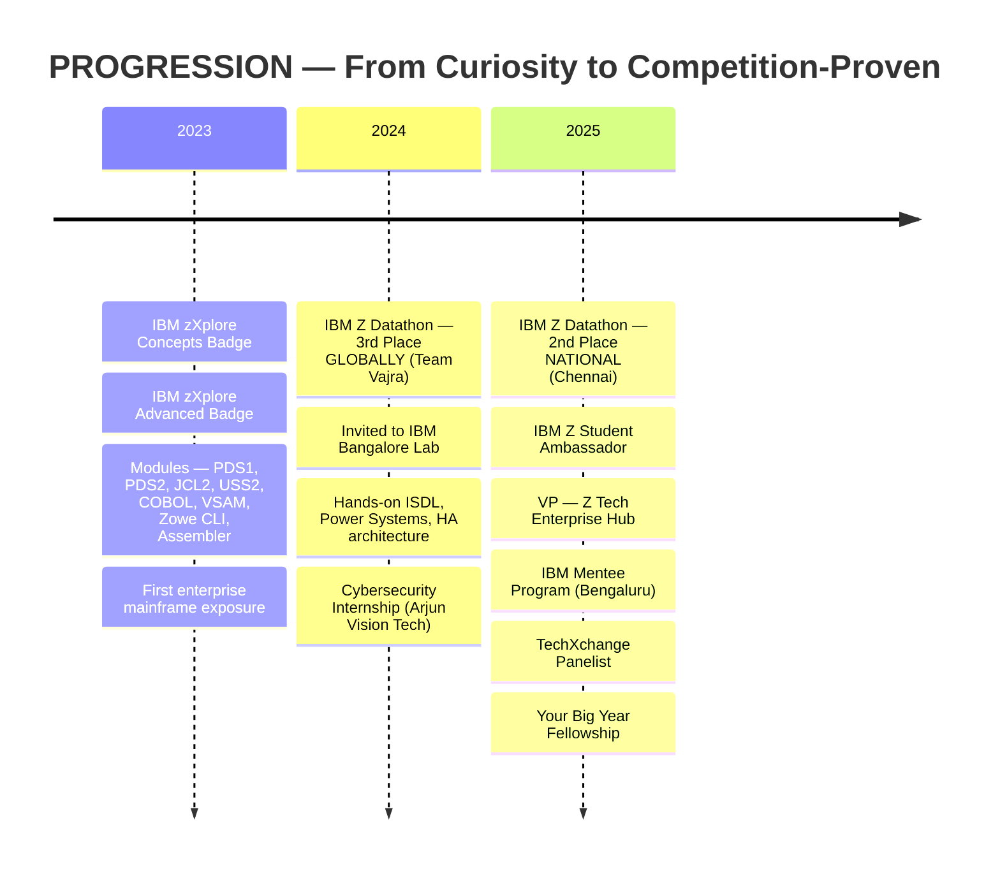

<div align="center">


<br/>


</div>

<br/>

<div align="center">

[](https://www.linkedin.com/in/shivraj-r-18008b290/)
[](https://portfolio-shivraj.web.app/)
[](mailto:rshivrajrajasekaran@gmail.com)
[](https://github.com/ShivrajRajasekaran)

</div>

<br/>

<!-- ═══════════════════════════════════════════════════════ -->

<details open>
<summary><h2>📡 System Identification</h2></summary>

```js
const shivraj = {
    identity: {
        name:       "Shivraj R",
        degree:     "B.E. Computer Science & Engineering (IoT)",
        institute:  "Saveetha Engineering College",
        timeline:   "2023 — 2027",
        location:   "Chennai, Tamil Nadu 🇮🇳",
    },
    
    clearance: [
        "IBM Z Student Ambassador",
        "Vice President — Z Tech Enterprise Hub",
        "Your Big Year Fellow (2025)",
        "IBM Mentee (Bengaluru)",
    ],
    
    combat_record: {
        "IBM Z Datathon 2024": "🥉 3rd Place GLOBALLY — Team Vajra",
        "IBM Z Datathon 2025": "🥈 2nd Place NATIONALLY — Chennai",
        "IBM Bangalore Lab":   "🎖️ Invited · ISDL · Power Systems · HA Architecture",
    },
    
    directive: "I build systems where failure is not an option.",
};
```

</details>

<!-- ═══════════════════════════════════════════════════════ -->

<details open>
<summary><h2>📖 The Story</h2></summary>

<br/>

I didn't start with a plan. I started with curiosity — pulling systems apart to see how they worked, then figuring out how to put them back together stronger.

That curiosity led to **cybersecurity and IoT** — understanding how devices communicate, where they break, and how attackers think. From there I found **IBM Z and mainframes** — the invisible infrastructure behind every bank transaction, airline reservation, and government system you depend on. I realized this is where the real engineering lives: systems designed for zero downtime, built decades ago, still running the world.

I didn't just study it. I competed. **Team Vajra placed 3rd globally at the IBM Z Datathon 2024**, which earned us an invitation to **IBM's Bangalore Lab** — where I got hands-on exposure to ISDL, Power Systems servers, and enterprise high-availability architecture. A year later, I placed **2nd nationally at IBM Z Datathon 2025** in Chennai.

Between competitions, I built: **blockchain systems** for fraud prevention, **Unity simulations** for medical and science education, and **IoT security prototypes** that test real-world attack surfaces. I also stepped into leadership — became an **IBM Z Student Ambassador**, **VP of Z Tech Enterprise Hub**, spoke on **TechXchange panels**, hosted orientation sessions for 100+ students across departments, and helped launch my college's mainframe community from scratch.

I'm not trying to be everything. I'm building toward one thing: **engineering systems where failure is not an option** — and having the technical depth, leadership experience, and competition record to prove I belong there.

</details>

<!-- ═══════════════════════════════════════════════════════ -->

<details open>
<summary><h2>⚡ Operational Domains</h2></summary>

<br/>

<table>
<tr>
<td width="50%" valign="top">

```yaml
# ═══ MAINFRAME & ENTERPRISE ═══
systems:
  - z/OS
  - COBOL
  - JCL
  - VSAM
  - USS
  - Zowe CLI
  - IBM Db2
  - Watson X
  - Assembler
  - ISDL
  
mission: |
  Enterprise systems that process 
  30 billion transactions per day.
  Banks, airlines, governments.
  Zero downtime. That's the standard.
```

</td>
<td width="50%" valign="top">

```yaml
# ═══ CYBERSECURITY & IoT ═══
capabilities:
  - Penetration Testing
  - Network Security
  - IoT Exploitation
  - WiFi Deauth Attacks
  - SQL Injection
  - Threat Modeling
  - MQTT Security
  - Ethical Hacking

training_grounds:
  - TryHackMe
  - HackTheBox
  - CTF Competitions
```

</td>
</tr>
<tr>
<td width="50%" valign="top">

```yaml
# ═══ BLOCKCHAIN & TRUST ═══
stack:
  - Solidity
  - Polygon (Mumbai Testnet)
  - Hardhat
  - Metamask
  - Alchemy
  - Smart Contracts

principle: |
  Trust should be cryptographic,
  not assumed. Fraud prevention,
  supply chain integrity,
  immutable verification.
```

</td>
<td width="50%" valign="top">

```yaml
# ═══ SIMULATION & EDTECH ═══
engine: Unity 2D/3D
language: C#
domains:
  - Educational Gamification
  - Medical Visualization
  - Atom Construction
  - Blood Flow Dynamics
  - Physics-based Interaction

philosophy: |
  If it's hard to explain on paper,
  make it something you can see,
  build, and interact with.
```

</td>
</tr>
</table>

</details>

<!-- ═══════════════════════════════════════════════════════ -->

<details open>
<summary><h2>🛠️ Technical Arsenal</h2></summary>

<br/>

<div align="center">

<table>
<tr>
<td align="center" width="14%"><br/><sub>Python</sub></td>
<td align="center" width="14%"><br/><sub>C</sub></td>
<td align="center" width="14%"><br/><sub>C#</sub></td>
<td align="center" width="14%"><br/><sub>Java</sub></td>
<td align="center" width="14%"><br/><sub>JavaScript</sub></td>
<td align="center" width="14%"><br/><sub>Solidity</sub></td>
<td align="center" width="14%"><br/><sub>HTML</sub></td>
</tr>
<tr>
<td align="center"><br/><sub>CSS</sub></td>
<td align="center"><br/><sub>Linux</sub></td>
<td align="center"><br/><sub>Unity</sub></td>
<td align="center"><br/><sub>Git</sub></td>
<td align="center"><br/><sub>Docker</sub></td>
<td align="center"><br/><sub>Raspberry Pi</sub></td>
<td align="center"><br/><sub>Arduino</sub></td>
</tr>
</table>

<br/>

**Enterprise & Security Stack**


</div>

</details>

<!-- ═══════════════════════════════════════════════════════ -->

<details open>
<summary><h2>🚀 Mission Log — Projects</h2></summary>

<br/>

<table>
<tr>
<td width="50%" valign="top">

### ⛓️ Insurance Fraud Prevention

```
TYPE     : Blockchain Trust Infrastructure
NETWORK  : Polygon Mumbai Testnet
STACK    : Solidity · Hardhat · Alchemy · Metamask
STATUS   : Operational
```

Smart contracts that make fraudulent insurance claims mathematically impossible. Immutable on-chain verification where tampering = detection.

**Outcome:** Proves blockchain as an enforcement mechanism, not just hype.

</td>
<td width="50%" valign="top">

### 🧪 Chemistry Atom Builder

```
TYPE     : Unity 2D Educational Simulation
ENGINE   : Unity · C# · Physics2D
INPUT    : Drag protons & neutrons
OUTPUT   : Stable atoms → Periodic table unlock
STATUS   : Operational
```

Gamified atomic structure learning where building correct atoms progresses through the periodic table.

**Outcome:** Abstract science becomes tangible through play.

</td>
</tr>
<tr>
<td width="50%" valign="top">

### 🩸 Blood Flow Visualization

```
TYPE     : Unity 3D Medical Simulation
ENGINE   : Unity 3D · C# · Spline Paths
FEATURES : Rotating RBCs · Flow dynamics · Camera control
TARGET   : Medical education
STATUS   : Operational
```

Real-time circulatory system rendering — blood cells navigating veins with physics-accurate motion.

**Outcome:** Medical students observe what was previously only in textbooks.

</td>
<td width="50%" valign="top">

### 🖥️ IBM Z Enterprise Systems

```
TYPE     : Mainframe Development & Automation
STACK    : COBOL · JCL · VSAM · z/OS · Zowe CLI
CONTEXT  : zXplore + Datathon + Lab
VERIFIED : Competition-tested
STATUS   : Active development
```

Enterprise-grade mainframe work through IBM programs, global competitions, and lab environments.

**Outcome:** Not tutorial completions — competition-proven, lab-verified work.

</td>
</tr>
</table>

</details>

<!-- ═══════════════════════════════════════════════════════ -->

<details open>
<summary><h2>📡 Growth Signal — IBM Z Timeline</h2></summary>

<br/>



</details>

<!-- ═══════════════════════════════════════════════════════ -->

<details open>
<summary><h2>🎖️ Leadership & Community Footprint</h2></summary>

<br/>

```
┌────────────────────────────────────────────────────────────────────────────────┐
│                                                                                │
│  ┌─ IBM Z STUDENT AMBASSADOR ──────────────────────────────────────────────┐   │
│  │  • Promoting Z Xplore to 200+ students across campus                   │   │
│  │  • Organizing hackathons, workshops, orientation sessions               │   │
│  │  • Mentoring peers in enterprise computing career paths                 │   │
│  └─────────────────────────────────────────────────────────────────────────┘   │
│                                                                                │
│  ┌─ VP — Z TECH ENTERPRISE HUB ───────────────────────────────────────────┐   │
│  │  • Co-founded the college mainframe community from zero                 │   │
│  │  • Hosted multi-department IBM Z orientation (100+ attendees)           │   │
│  │  • Second speaker in 2-hour mainframe community launch event           │   │
│  │  • Driving IBM Z awareness across all engineering departments           │   │
│  └─────────────────────────────────────────────────────────────────────────┘   │
│                                                                                │
│  ┌─ TECHXCHANGE PANELIST ──────────────────────────────────────────────────┐   │
│  │  • Spoke on mainframe relevance and student-to-enterprise pipeline      │   │
│  └─────────────────────────────────────────────────────────────────────────┘   │
│                                                                                │
│  ┌─ EVENT ORGANIZER & TECHNICAL SPEAKER ───────────────────────────────────┐   │
│  │  • Organized offline IBM Z events across multiple departments           │   │
│  │  • Hosted hackathons, blockchain workshops, IoT security sessions       │   │
│  │  • Public speaking, debates, cross-department technical talks           │   │
│  └─────────────────────────────────────────────────────────────────────────┘   │
│                                                                                │
│  ┌─ YOUR BIG YEAR FELLOWSHIP (2025) ──────────────────────────────────────┐   │
│  │  • Selected for professional development and leadership growth          │   │
│  └─────────────────────────────────────────────────────────────────────────┘   │
│                                                                                │
│  ┌─ INDUSTRY EXPOSURE ─────────────────────────────────────────────────────┐   │
│  │  • Digital marketing & product promotion (post-12th)                    │   │
│  │  • Zybeak Technologies — In-Plant Training (2025)                       │   │
│  │  • Arjun Vision Tech — Cybersecurity Internship (2024)                  │   │
│  └─────────────────────────────────────────────────────────────────────────┘   │
│                                                                                │
└────────────────────────────────────────────────────────────────────────────────┘
```

</details>

<!-- ═══════════════════════════════════════════════════════ -->

<details open>
<summary><h2>📜 Verified Credentials</h2></summary>

<br/>

```python
credentials = {
    "IBM_Z_Mainframe": [
        "zXplore Concepts Badge",
        "zXplore Advanced Badge",
        "PDS1", "PDS2", "JCL2", "USS2",
        "COBOL", "VSAM", "Zowe CLI", "HTML",
        "IBM Z Assembler (Introduction)",
    ],
    
    "Cybersecurity": [
        "Introduction to Cyber Security",
        "SQL Injection Attack",
        "Entry-Level Cybersecurity Training",
    ],
    
    "Programs_&_Fellowships": [
        "IBM Z Student Ambassador",
        "IBM Mentee Program (Bengaluru)",
        "Your Big Year Fellowship",
    ],
}
```

</details>

<!-- ═══════════════════════════════════════════════════════ -->

<details open>
<summary><h2>🎯 Current Vector</h2></summary>

<br/>

```bash
$ cat /etc/shivraj/roadmap.conf

# ══════════════════════════════════════════
# ACTIVE PURSUITS
# ══════════════════════════════════════════

MAINFRAME_MODERNIZATION="Bridging legacy z/OS → hybrid cloud"
ENTERPRISE_ARCHITECTURE="Designing for reliability at planetary scale"
IOT_SECURITY="Secure device comms, embedded defense layers"
ETHICAL_HACKING="TryHackMe | HackTheBox | CTF challenges"
BLOCKCHAIN="Enterprise-grade distributed trust systems"
SIMULATION="Interactive learning engines via Unity"

# ══════════════════════════════════════════
# NEXT MILESTONES
# ══════════════════════════════════════════

CERT_TARGET_1="CEH — Certified Ethical Hacker"
CERT_TARGET_2="Advanced z/OS Systems Programming"
CONTRIBUTION="Open-source enterprise tooling"
```

</details>

<!-- ═══════════════════════════════════════════════════════ -->

<details open>
<summary><h2>📊 System Metrics</h2></summary>

<br/>

<div align="center">

<!-- Streak: proven working -->


<br/><br/>

<!-- Activity Graph: proven working -->


<br/><br/>

<!-- Snake animation (will work after first workflow run) -->
<picture>
  <source media="(prefers-color-scheme: dark)" srcset="https://raw.githubusercontent.com/ShivrajRajasekaran/ShivrajRajasekaran/output/github-snake-dark.svg" />
  <source media="(prefers-color-scheme: light)" srcset="https://raw.githubusercontent.com/ShivrajRajasekaran/ShivrajRajasekaran/output/github-snake.svg" />
  
</picture>

</div>

</details>

<!-- ═══════════════════════════════════════════════════════ -->

<br/>

<div align="center">


<br/><br/>

### If you're building enterprise systems that need to be secure, scalable, and always on — I want to be part of that.

<br/>

[](https://www.linkedin.com/in/shivraj-r-18008b290/)
&nbsp;&nbsp;
[](https://portfolio-shivraj.web.app/)
&nbsp;&nbsp;
[](mailto:rshivrajrajasekaran@gmail.com)

<br/>

</div>


