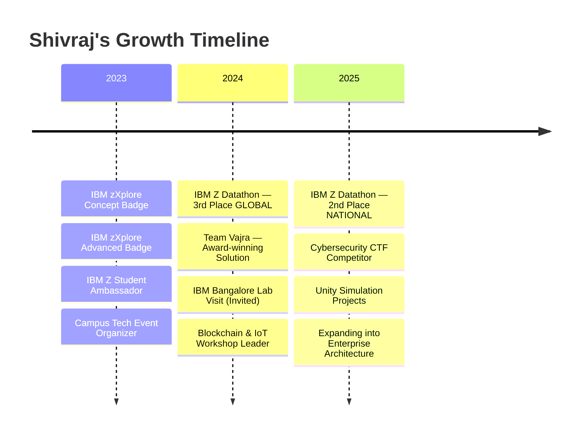

<div align="center">

<!-- HERO: Animated typing with professional titles -->


<br/>

<!-- Identity Card: Unique terminal boot sequence -->
```
┏━━━━━━━━━━━━━━━━━━━━━━━━━━━━━━━━━━━━━━━━━━━━━━━━━━━━━━━━━━━━━━━━━━━━━━┓
┃  SYSTEM BOOT :: shivraj@enterprise                                     ┃
┃  ══════════════════════════════════════════════════════════════════════  ┃
┃                                                                        ┃
┃  OPERATOR    : Shivraj Rajasekaran                                     ┃
┃  PROGRAM     : B.E. CSE (IoT) · Saveetha Engineering College          ┃
┃  LOCATION    : Chennai, Tamil Nadu 🇮🇳                                  ┃
┃  CLEARANCE   : IBM Z Student Ambassador                                ┃
┃                                                                        ┃
┃  ┌─ COMBAT RECORD ───────────────────────────────────────────────┐     ┃
┃  │  🏆 IBM Z Datathon 2024 — 3rd Place GLOBAL (Team Vajra)      │     ┃
┃  │  🏆 IBM Z Datathon 2025 — 2nd Place NATIONAL (Chennai)       │     ┃
┃  │  🎖️  IBM Bangalore Lab — Invited Post-Win (2024)              │     ┃
┃  └───────────────────────────────────────────────────────────────┘     ┃
┃                                                                        ┃
┃  DIRECTIVE   : "Build what matters. Prove it works. Ship it."          ┃
┃                                                                        ┃
┗━━━━━━━━━━━━━━━━━━━━━━━━━━━━━━━━━━━━━━━━━━━━━━━━━━━━━━━━━━━━━━━━━━━━━━┛
```

<br/>

<!-- Contact Badges -->
[](https://github.com/ShivrajRajasekaran)
[](https://www.linkedin.com/in/shivraj-r-18008b290/)
[](mailto:rshivrajrajasekaran@gmail.com)
[](https://github.com/ShivrajRajasekaran)

</div>

---

## `> cat /proc/shivraj/mission`

```ini
[identity]
role        = "Next-Generation Infrastructure Engineer"
focus       = "Secure, scalable systems that enterprises depend on"
method      = "Learn → Break → Fix → Build → Ship → Repeat"

[domains]
primary     = "IBM Z Mainframe Modernization"
secondary   = "Cybersecurity + IoT Security"
emerging    = "Blockchain Trust Systems + Unity Simulations"

[philosophy]
core        = "Systems that fail aren't systems. I build the ones that don't."
approach    = "Depth over breadth. Proof over claims. Impact over noise."
```

---

## ⚡ What I Build

<table>
<tr>
<td width="50%">

### 🖥️ Mainframe & Enterprise Systems
```
z/OS │ COBOL │ JCL │ VSAM │ USS
Zowe CLI │ Assembler │ IBM zXplore
ISDL │ Mainframe Modernization
```
Enterprise systems powering global banking, aviation, and government — built for zero downtime. That's my lane.

</td>
<td width="50%">

### 🔐 Cybersecurity & IoT Security
```
Penetration Testing │ Network Security
TryHackMe │ HackTheBox │ CTFs
IoT Exploitation │ MQTT Security
Threat Modeling │ Ethical Hacking
```
Thinking like both attacker and defender. Security is the foundation, not a checkbox.

</td>
</tr>
<tr>
<td width="50%">

### ⛓️ Blockchain & Trust Systems
```
Solidity │ Polygon │ Hardhat
Metamask │ Alchemy │ Smart Contracts
DApp Architecture │ Immutable Records
```
Building tamper-proof systems for real business problems — fraud prevention, credential verification, supply chain trust.

</td>
<td width="50%">

### 🎮 Unity Simulations & EdTech
```
Unity 2D/3D │ C# │ Physics Engines
Educational Gamification │ Medical Viz
Atom Building │ Blood Flow Dynamics
Camera Systems │ Interactive Learning
```
Turning complex science into something you can see, touch, and understand.

</td>
</tr>
</table>

---

## 🏆 Journey & Milestones



<div align="center">

| Achievement | Details | Impact |
|:---|:---|:---:|
| **IBM Z Datathon 2024** | 3rd Place Globally · Team Vajra | 🌍 |
| **IBM Bangalore Lab Visit** | Invited post-win · Hands-on mainframe ISDL | 🏢 |
| **IBM Z Datathon 2025** | 2nd Place National · Chennai | 🇮🇳 |
| **IBM Z Student Ambassador** | Mentoring peers in mainframe technology | 🎖️ |
| **Tech Event Leadership** | Organized hackathons, IoT & blockchain workshops | 🎤 |
| **CTF & HackTheBox** | Active competitor in security challenges | ⚔️ |

</div>

---

## 🛠️ Technical Arsenal

<div align="center">

**`── Languages ──`**


**`── Platforms & Infrastructure ──`**


**`── Blockchain & Security Tools ──`**


</div>

---

## 📜 IBM Z Credentials

<div align="center">

```
╔═══════════════════════════════════════════════════════════════════════╗
║                    IBM Z LEARNING MILESTONES                          ║
╠═══════════════════════════════════════════════════════════════════════╣
║                                                                       ║
║   ✅ zXplore Concepts        ✅ zXplore Advanced       ✅ COBOL      ║
║   ✅ JCL2                    ✅ USS2                    ✅ VSAM       ║
║   ✅ PDS1 & PDS2             ✅ Zowe CLI               ✅ HTML       ║
║   ✅ IBM Z Assembler (Intro)                                         ║
║                                                                       ║
║   STATUS: Ambassador · Lab-Certified · Competition-Proven            ║
║                                                                       ║
╚═══════════════════════════════════════════════════════════════════════╝
```

</div>

---

## 🚀 Featured Projects

<table>
<tr>
<td width="50%">

### ⛓️ Insurance Fraud Prevention
**Blockchain-powered trust layer**

A smart-contract system on Polygon that detects and prevents fraudulent insurance claims through immutable record verification.

`Solidity` `Hardhat` `Alchemy` `Metamask` `Polygon Mumbai`

**Impact:** Tamper-proof claims processing for real-world fraud scenarios.

</td>
<td width="50%">

### 🧪 Chemistry Learning Simulator
**Unity 2D interactive education**

Gamified atomic structure learning — users drag protons and neutrons to build stable atoms, unlocking elements on the periodic table.

`Unity` `C#` `Physics Engine` `Game Design`

**Impact:** Makes abstract chemistry tangible through play.

</td>
</tr>
<tr>
<td width="50%">

### 🩸 Blood Flow Visualization
**Unity 3D medical simulation**

Real-time visualization of blood cells traveling through veins using spline paths, with rotating RBCs and dynamic camera controls.

`Unity 3D` `C#` `Spline Paths` `Medical Viz`

**Impact:** Educational tool for medical students and biology learners.

</td>
<td width="50%">

### 🖥️ IBM Z Mainframe Projects
**Enterprise system automation**

Hands-on mainframe development including COBOL programs, JCL job processing, VSAM operations, and z/OS workflow automation.

`COBOL` `JCL` `VSAM` `z/OS` `Zowe CLI`

**Impact:** Real enterprise-grade system experience, not tutorials.

</td>
</tr>
</table>

---

## 📊 GitHub Analytics

<div align="center">


<br/><br/>


<br/><br/>

<!-- Activity Graph -->


</div>

---

## 🎯 Current Vector

```python
class Shivraj:
    def __init__(self):
        self.building_now = [
            "Mainframe modernization strategies",
            "Secure IoT communication protocols",
            "Enterprise blockchain applications",
            "Real-time simulation engines",
        ]
        self.targeting_roles = [
            "Mainframe Engineer / Modernization Architect",
            "Cybersecurity Specialist",
            "Enterprise Systems Developer",
            "IoT Security Engineer",
        ]
        self.next_milestones = [
            "CEH Certification",
            "Advanced z/OS Systems Programming",
            "Open-source enterprise tool contributions",
        ]

    def philosophy(self):
        return "I don't chase hype. I chase problems worth solving."
```

---

## 🤝 Beyond Code

<div align="center">

```
┌──────────────────────────────────────────────────────────────┐
│                                                              │
│   🎤 Technical Speaker    🏗️ Event Organizer                 │
│   👥 Team Leader          📢 Digital Marketer                │
│   🧠 Mentor (IBM Z)      🏆 Competition Veteran             │
│                                                              │
│   "Good engineers don't only write code.                     │
│    They explain, present, coordinate, and lead."             │
│                                                              │
└──────────────────────────────────────────────────────────────┘
```

</div>

---

<div align="center">


<br/><br/>

**Building at the intersection of mainframes, security, blockchain & simulation.**

**If you're hiring for roles where reliability matters — let's talk.**

<br/>

[](https://www.linkedin.com/in/shivraj-r-18008b290/)
[](mailto:rshivrajrajasekaran@gmail.com)

</div>

---

<div align="center">
<sub>Last updated: May 2025 · Built with intention, not templates.</sub>
</div>
