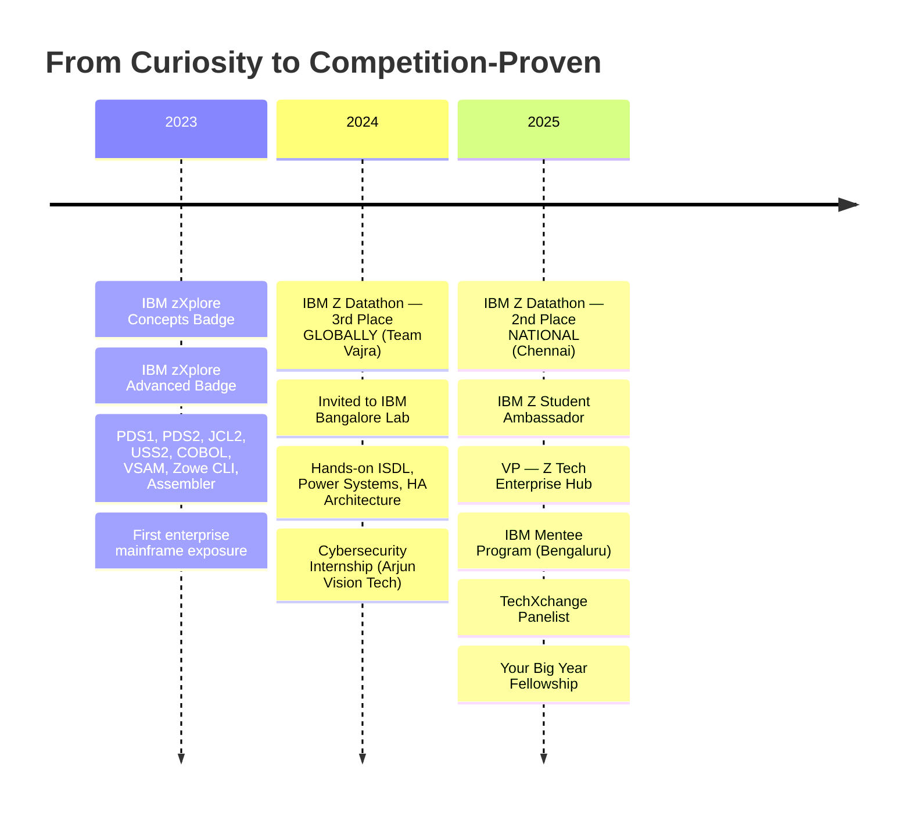

<div align="center">


<br/>

[](https://www.linkedin.com/in/shivraj-r-18008b290/)
[](https://portfolio-shivraj.web.app/)
[](mailto:rshivrajrajasekaran@gmail.com)
[](https://github.com/ShivrajRajasekaran)

</div>

<br/>

```js
// ═══════════════════════════════════════════════════════════════════
//  $ system --identify
// ═══════════════════════════════════════════════════════════════════

const engineer = {
    name:       "Shivraj R",
    degree:     "B.E. CSE (IoT) · Saveetha Engineering College · 2023–2027",
    location:   "Chennai, Tamil Nadu 🇮🇳",
    positions:  ["IBM Z Student Ambassador", "VP — Z Tech Enterprise Hub", "Your Big Year Fellow"],
    
    record: {
        "2024": "🏆 IBM Z Datathon — 3rd Place GLOBALLY (Team Vajra)",
        "2024": "🎖️ Invited to IBM Bangalore Lab (ISDL + Power Systems)",
        "2025": "🏆 IBM Z Datathon — 2nd Place NATIONALLY (Chennai)",
    },
    
    mission: "I build systems where failure is not an option."
};
```

---

<h2>The Story</h2>

I started with curiosity — pulling systems apart, figuring out how to put them back together stronger. That curiosity led to **cybersecurity and IoT**, then to **IBM Z and mainframes** — the invisible infrastructure behind every bank, airline, and government system. Built for zero downtime. Still running the world.

**Team Vajra placed 3rd globally at IBM Z Datathon 2024** → invited to **IBM's Bangalore Lab** (ISDL, Power Systems, HA architecture). A year later → **2nd nationally at IBM Z Datathon 2025**.

Between competitions: **blockchain fraud prevention systems**, **Unity medical simulations**, **IoT security prototypes**. In leadership: **IBM Z Ambassador**, **VP of Z Tech Enterprise Hub**, **TechXchange panelist**, hosted 100+ student orientations, launched my college's mainframe community from zero.

One direction: **engineering systems where failure is not an option.**

---

<h2>Domains</h2>

<div align="center">

<table>
<tr><td align="center" width="25%">

**🖥️ Mainframe**
<br/><br/>
z/OS · COBOL · JCL<br/>
VSAM · USS · Zowe CLI<br/>
IBM Db2 · Watson X<br/>
Assembler · ISDL
<br/><br/>
<sub>30B transactions/day.<br/>Zero downtime. My lane.</sub>

</td><td align="center" width="25%">

**🔐 Cybersecurity**
<br/><br/>
Pentesting · IoT Exploits<br/>
WiFi Deauth · SQL Injection<br/>
Threat Modeling · MQTT<br/>
TryHackMe · HackTheBox
<br/><br/>
<sub>Think like the attacker.<br/>Build like the defender.</sub>

</td><td align="center" width="25%">

**⛓️ Blockchain**
<br/><br/>
Solidity · Polygon<br/>
Hardhat · Metamask<br/>
Alchemy · ZKML<br/>
Smart Contracts
<br/><br/>
<sub>Trust = cryptographic.<br/>Not assumed.</sub>

</td><td align="center" width="25%">

**🎮 Simulations**
<br/><br/>
Unity 2D/3D · C#<br/>
Physics Engines<br/>
Medical Viz · EdTech<br/>
Gamified Learning
<br/><br/>
<sub>Hard to explain on paper?<br/>Make it interactive.</sub>

</td></tr>
</table>

</div>

---

<h2>Tech Stack</h2>

<div align="center">

<table>
<tr>
<td align="center" width="70"><br><sub>Python</sub></td>
<td align="center" width="70"><br><sub>C</sub></td>
<td align="center" width="70"><br><sub>C#</sub></td>
<td align="center" width="70"><br><sub>Java</sub></td>
<td align="center" width="70"><br><sub>JS</sub></td>
<td align="center" width="70"><br><sub>Solidity</sub></td>
<td align="center" width="70"><br><sub>HTML</sub></td>
<td align="center" width="70"><br><sub>CSS</sub></td>
<td align="center" width="70"><br><sub>Linux</sub></td>
</tr>
<tr>
<td align="center"><br><sub>Unity</sub></td>
<td align="center"><br><sub>Git</sub></td>
<td align="center"><br><sub>Docker</sub></td>
<td align="center"><br><sub>VS Code</sub></td>
<td align="center"><br><sub>RPi</sub></td>
<td align="center"><br><sub>Arduino</sub></td>
<td align="center"><br><sub>SQL</sub></td>
<td align="center"><br><sub>MongoDB</sub></td>
<td align="center"><br><sub>React</sub></td>
</tr>
</table>

<br/>


</div>

---

<h2>Featured Repositories</h2>

<div align="center">
<table>
<tr>
<td width="50%" valign="top">

### [`AI-Driven-Banking-Fraud-Detection`](https://github.com/ShivrajRajasekaran/AI-Driven-Banking-Fraud-Detection-and-Prevention-System)
**IBM Z Datathon 2024 — 3rd Place Global**

AI anomaly detection + Twilio phone verification for real-time banking fraud prevention. Deployed on IBM LinuxONE.

`Python` `OpenAI` `Streamlit` `IBM LinuxONE` `Twilio`

</td>
<td width="50%" valign="top">

### [`Enterprise-Workflow-Choreographer`](https://github.com/ShivrajRajasekaran/Enterprise-Workflow-Choreographer)
**Agentic AI for Incident Response**

IBM watsonx.ai dynamically coordinates ServiceNow, Slack, GitHub, Jira without rigid workflows. AI determines optimal action sequences.

`JavaScript` `Python` `React` `MongoDB` `Docker`

</td>
</tr>
<tr>
<td width="50%" valign="top">

### [`V-Inference-Verifiable-Network`](https://github.com/ShivrajRajasekaran/V-Inference-Verifiable-Inference-Network-)
**Decentralized AI with Zero-Knowledge Proofs**

ZKML-verified AI inference on Shardeum blockchain. ZK-SNARK proofs for every result. Decentralized worker nodes with staking.

`Python` `TypeScript` `Solidity` `FastAPI` `Next.js`

</td>
<td width="50%" valign="top">

### [`AI-Powered-Heart-MRI-Classification`](https://github.com/ShivrajRajasekaran/AI-Powered-Heart-MRI-Classification-for-Clinical-Decision-Support)
**Clinical Decision Support System**

CNN-based cardiac MRI classification for clinical diagnostics. Deep learning model supporting real-time medical decisions.

`Python` `TensorFlow` `OpenCV` `CNN` `Medical AI`

</td>
</tr>
<tr>
<td width="50%" valign="top">

### [`Master-ForexTrader-MCP`](https://github.com/ShivrajRajasekaran/Master-ForexTrader-MCP)
**Institutional-Grade Trading Analysis**

20 analysis engines, 22 MCP tools, SMC/ICT-based 7-gate entry system. Kill zones, order flow, risk management, backtesting.

`JavaScript` `Python` `MCP Protocol` `Kalman Filter`

</td>
<td width="50%" valign="top">

### [`SIH-1706-Enterprise-Assistant`](https://github.com/ShivrajRajasekaran/Hackathon-An-Intelligent-Enterprise-Assistant-for-public-sector-SIH-1706-)
**Intelligent Public Sector Assistant**

Smart India Hackathon 2024 solution for public sector enterprise workflow automation and citizen services.

`AI` `Enterprise` `Public Sector` `Hackathon`

</td>
</tr>
</table>
</div>

---

<h2>IBM Z Journey</h2>



<div align="center">

| Year | Milestone | Significance |
|:---:|:---|:---|
| **2023** | zXplore Concepts & Advanced Badges | PDS1, PDS2, JCL2, USS2, COBOL, VSAM, Zowe CLI, Assembler |
| **2024** | **🏆 IBM Z Datathon — 3rd GLOBALLY** | Team Vajra. Real enterprise problem-solving on global stage |
| **2024** | **🎖️ IBM Bangalore Lab Visit** | Invited post-win. ISDL, Power Systems, HA architecture |
| **2025** | **🏆 IBM Z Datathon — 2nd NATIONAL** | Sustained performance at national level, Chennai |
| **2025** | IBM Z Student Ambassador | Mentoring 200+ students in enterprise computing |
| **2025** | VP — Z Tech Enterprise Hub | Built college mainframe community from zero |
| **2025** | TechXchange Panelist | Spoke on mainframe relevance & career pathways |
| **2025** | IBM Mentee + Your Big Year Fellow | Bengaluru mentorship + leadership fellowship |

</div>

---

<h2>Leadership</h2>

<div align="center">
<table>
<tr>
<td align="center" width="33%">

**IBM Z Ambassador**
<br/><br/>
Promoting Z Xplore to 200+ students. Organizing hackathons. Mentoring peers in enterprise computing.

</td>
<td align="center" width="33%">

**VP — Z Tech Hub**
<br/><br/>
Co-founded mainframe community from zero. Hosted 100+ person orientation. Multi-department outreach.

</td>
<td align="center" width="33%">

**TechXchange Panelist**
<br/><br/>
Spoke on mainframe career pathways. Technical orientation speaker. Public speaking & debates.

</td>
</tr>
</table>
</div>

<div align="center">

`Your Big Year Fellow` · `IBM Mentee (Bengaluru)` · `Cybersecurity Intern` · `Event Organizer` · `Digital Marketing`

</div>

---

<h2>Certifications</h2>

<div align="center">

| | Credentials |
|:---|:---|
| **IBM Z** | zXplore Concepts · Advanced · PDS1 · PDS2 · JCL2 · USS2 · COBOL · VSAM · Zowe CLI · Assembler Intro |
| **Security** | Intro to Cybersecurity · SQL Injection Attack · Entry-Level Cybersecurity Training |
| **Programs** | IBM Z Ambassador · IBM Mentee · Your Big Year Fellow |

</div>

---

<h2>Current Vector</h2>

```
┌─────────────────────────────────────────────────────────────────┐
│                                                                 │
│   NOW        Mainframe Modernization · Enterprise Architecture  │
│              IoT Security · Ethical Hacking · Blockchain DApps  │
│                                                                 │
│   NEXT       CEH Certification                                  │
│              Advanced z/OS Systems Programming                   │
│              Open-source enterprise contributions                │
│                                                                 │
│   TARGET     Mainframe Engineer / Modernization Architect       │
│              Enterprise Security Engineer                        │
│              Secure Systems Developer                            │
│                                                                 │
└─────────────────────────────────────────────────────────────────┘
```

---

<h2>Activity</h2>

<div align="center">


<br/><br/>


</div>

---

<div align="center">


<br/><br/>

**Building enterprise systems that are secure, scalable, and always on.**

<br/>

[](https://www.linkedin.com/in/shivraj-r-18008b290/)
&nbsp;
[](https://portfolio-shivraj.web.app/)
&nbsp;
[](mailto:rshivrajrajasekaran@gmail.com)

</div>


